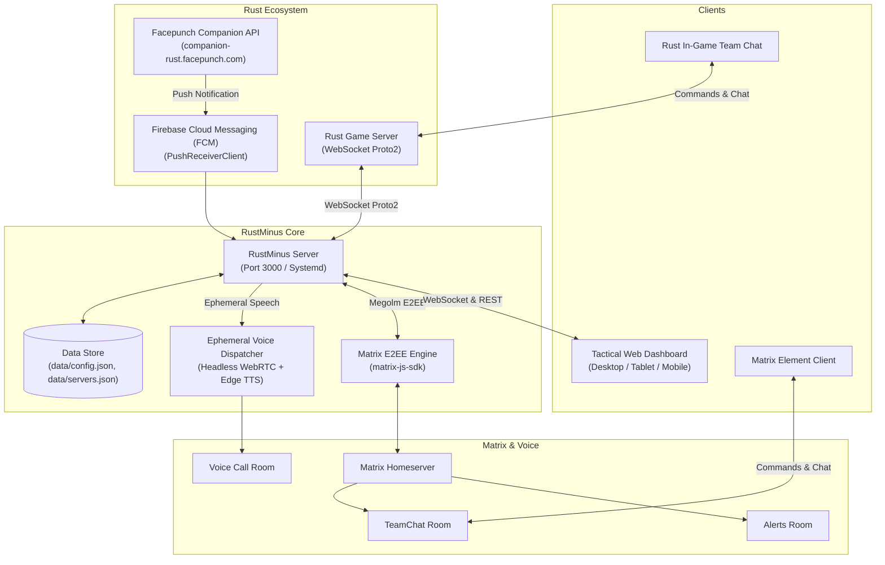

# ⚡ rustminus

> **Next-Generation Rust+ Companion Multi-Server Manager, Tactical Web Radar, and Matrix E2EE Voice Sentinel**

[](https://nodejs.org/)
[](LICENSE)
[](https://github.com/liamcottle/rustplus.js)
[](https://matrix.org/)

`rustminus` is an all-in-one companion management platform for Rust players, clans, and server operators. It bridges live Rust+ game servers, Facepunch Firebase Cloud Messaging (FCM) push notifications, a high-performance web dashboard with an interactive tactical map, Matrix end-to-end encrypted (E2EE) chat rooms, and automated WebRTC voice call alerts.

---

## 🌟 Key Features

### 1. 🗺️ Interactive Tactical Island Radar (`getMap`)
- **Real-Time Map Rendering:** Streams high-resolution in-game JPEG imagery directly from Facepunch servers.
- **Dynamic Pan & Zoom:** Interactive HTML5 Canvas with smooth wheel zoom, click-and-drag panning, and one-click centering.
- **26×26 Tactical Grid:** Accurate sector grid overlay (A0 through Z25) matching in-game Rust coordinates.
- **Monument Pins:** Visual markers for all major monuments (Launch Site, Airfield, Oil Rigs, Military Tunnels, The Dome, etc.).
- **Live Sector Coordinate Tracking:** Real-time meter coordinate readout `(X, Y)` and sector calculation on cursor hover.

### 2. ℹ️ Rust Server Telemetry (`getInfo`)
- **Server Identity Banner:** Displays official header banner image, server logo, and connection endpoints.
- **Live Capacity Meter:** Visual player count gauge (`online / max`) with animated progress bar and active queue count.
- **Procedural World Specs:** Map type (`Procedural Map`), map size (e.g., `4500m`), procedural seed, and salt.
- **Wipe Clock:** Calculates time elapsed since last server wipe (e.g., `Wiped 2d 6h ago`) and exact timestamp.

### 3. ⏱️ In-Game Time & Celestial Cycle (`getTime`)
- **Digital In-Game Clock:** Real-time Rust world time display (e.g., `18:42`).
- **Celestial Arc & Gauge:** Visual daylight progress bar displaying exact sunrise and sunset times.
- **Daylight Countdown:** Real-time calculation of remaining daylight minutes until sunset or night minutes until sunrise.

### 4. 🛒 Vending Marketplace & Event Radar (`getMapMarkers`)
- **Active World Event Radar:** Live tracking and map pin overlay for:
  - 🚢 Cargo Ship (with real-time heading and rotation angle)
  - 🚁 Patrol Helicopter
  - 🛩️ CH47 Chinook
  - 📦 Locked Crates (Oil Rig, Cargo, Monuments)
  - 💥 Explosions & Breaches
- **Island Vending Machine Search:**
  - Built-in Rust item dictionary translating item IDs into names and descriptions.
  - Search any item for sale (e.g., `sulfur`, `rocket`, `c4`, `scrap`, `cloth`, `metal`).
  - Filters for **In-Stock Only** and **Blueprints Only**.
  - Detailed pricing, required currency, available stock, and blueprint badges.

### 5. 🛡️ Team Telemetry & Tactical Roster (`getTeamInfo`)
- **Live Team Roster:** Real-time display of team members with avatars, Steam profile links, and 👑 Leader indicators.
- **Status Indicators:** `🟢 Online & Alive`, `💤 Sleeping`, and `💀 Dead`.
- **Position Tracking:** Grid sector (e.g. `N13`) and exact `(X, Y)` world coordinates plotted on the map.
- **One-Click Promotion:** Promote any teammate to Team Leader directly from the web interface.

### 6. ⚡ Master Base Automation
- **Batch Base Controls:** One-click toggles for all compound Auto-Turrets, SAM air defense sites, compound lights, and smart doors.
- **Emergency Strobe:** Rapidly strobes paired switches for disco or warning beacon effects.
- **Smart Alarms:** Listens for in-game sensor triggers and dispatches instant push and voice alerts.

### 7. 🔐 Matrix E2EE Integration & Ephemeral Voice Bot
- **Matrix Rooms:** Dedicated channels for **Alerts**, **In-Game Team Chat Relay**, and **Raid Alarms**.
- **In-Game Commands:** Control your base from in-game team chat with `!turrets on/off`, `!sams on/off`, `!time`, `!pop`, `!events`, `!vending <item>`, `!promote <name>`.
- **Ephemeral Voice Announcer:** High-speed (150%) text-to-speech WebRTC audio injection into Matrix voice rooms with connect-speak-disconnect lifecycle (zero idle ghost bots).

---

## 🏗️ Architecture



---

## 🔒 Security Notice

This repository contains **NO API keys, passwords, session tokens, or private secrets**. 
All sensitive operational parameters are loaded from `data/config.json` and `data/servers.json` (which are strictly ignored by `.gitignore`), or via standard environment variables.

---

## 🚀 Quickstart & Installation

### Prerequisites
- **Operating System:** Linux (Ubuntu 20.04/22.04/24.04 recommended), macOS, or Windows WSL2
- **Node.js:** v18.0.0 or newer
- **Python 3:** (optional, for edge-tts voice alert synthesis: `pip install edge-tts`)
- **FFmpeg:** (optional, for voice alerts audio normalization: `sudo apt install ffmpeg`)
- **Chromium:** (optional, for automated WebRTC voice room joining)

### 1. Clone the Repository
```bash
git clone https://github.com/pranabeshsingh/rustminus.git
cd rustminus
```

### 2. Install Dependencies
```bash
npm install
```
> **Note:** The postinstall script `scripts/patch-rustplus.js` runs automatically during `npm install` to update the underlying `@liamcottle/rustplus.js` library with modern Facepunch protobuf schemas and Promise/async-await support.

### 3. Configure Credentials
Copy the provided example configuration templates:
```bash
cp data/config.example.json data/config.json
cp data/servers.example.json data/servers.json
```

#### A. Generate Admin Password Hash
Generate a bcrypt hash for your web dashboard administrator password:
```bash
node -e 'const bcrypt = require("bcrypt"); console.log(bcrypt.hashSync("YourSecurePassword123!", 10));'
```
Paste this hash into `data/config.json` under `"adminPasswordHash"`.

#### B. Configure Matrix (Optional)
If using Matrix notifications, fill in `data/config.json` with your Matrix homeserver URL, bot credentials, and room IDs.

#### C. Configure Rust Server
Add your server details to `data/servers.json`:
```json
[
  {
    "id": "srv_main_1",
    "name": "[US] Rust Server",
    "ip": "123.45.67.89",
    "port": 28082,
    "playerId": "76561198000000000",
    "playerToken": 123456789,
    "useFacepunchProxy": false,
    "isActive": true,
    "switches": [],
    "alarms": []
  }
]
```
*(You can also pair servers automatically using the built-in FCM listener in the WebUI)*.

### 4. Start the Application
```bash
npm start
```
Open your browser and navigate to:
```
http://localhost:3000
```
Log in using username `admin` and your configured password.

---

## ⚙️ Production Deployment (systemd & Caddy)

### 1. systemd Service
Copy the unit file:
```bash
sudo cp deployment/rustplus-manager.service /etc/systemd/system/
sudo systemctl daemon-reload
sudo systemctl enable --now rustplus-manager.service
```

Check status:
```bash
sudo systemctl status rustplus-manager.service
```

### 2. Reverse Proxy with SSL (Caddy)
Add the following to `/etc/caddy/Caddyfile`:
```caddy
rust.yourdomain.com {
    reverse_proxy 127.0.0.1:3000
}
```
Reload Caddy:
```bash
sudo systemctl reload caddy
```

---

## 🎮 Command Directory

Commands can be executed directly inside **In-Game Team Chat** or the **Matrix `#team-chat` channel**. Supports both `!` and `.` prefixes.

| Command | Description | Example Output |
| :--- | :--- | :--- |
| `!info` | Server name, map specs, seed, player pop, wipe date | `ℹ️ [Server Info] Facepunch 1 \| Procedural Map (4500m) \| Seed: 3626...` |
| `!pop` / `!players` | Current player population and queue | `👥 [Pop] 45/300 Online \| Queue: 2` |
| `!time` / `!day` | In-game clock and daylight status | `☀️ [Time] 14:15 \| Sunrise: 07:31 \| Sunset: 20:05 (Day)` |
| `!team` / `!roster` | Teammate health status and map grid sector | `🛡️ [Team] Player1 🟢 Alive [N13] \| Player2 💤 Sleeping [M12]` |
| `!events` / `!map` | Active world events (Cargo, Heli, Chinook, Crates) | `🗺️ [Active Events] Cargo Ship @ G14 \| Patrol Helicopter @ N11` |
| `!vending <item>` | Search island shops for an item and price | `🛒 [Matches for "rocket"] "Raid Shop" @ M14: 1x Rocket for 500 Scrap` |
| `!turrets on` / `off` | Batch toggles all compound turrets | `⚡ Set 6/6 Turrets to ON.` |
| `!sams on` / `off` | Batch toggles roof SAM sites | `⚡ Set 3/3 SAMs to ON.` |
| `!lights on` / `off` | Batch toggles base lighting grid | `⚡ Set 12/12 Lights to ON.` |
| `!doors on` / `off` | Batch toggles smart door controllers | `⚡ Set 4/4 Doors to OFF.` |
| `!strobe <name>` | Rapidly strobes a named switch | `✨ Strobing switch "Compound Lights" (ID: 104829)!` |
| `!promote <name>` | Promotes a teammate to Team Leader | `👑 Promoted Player1 to Team Leader!` |
| `!status` | Server connection and Matrix bot status | `🤖 [Status] Server: Connected 🟢 \| Matrix: Online 🟢` |
| `!help` | Command listing | Displays all available commands |

---

## 🤝 Contributing

Contributions, issues, and feature requests are welcome! Feel free to check the [issues page](https://github.com/pranabeshsingh/rustminus/issues).

---

## 📜 License

Distributed under the MIT License. See [`LICENSE`](LICENSE) for more information.
