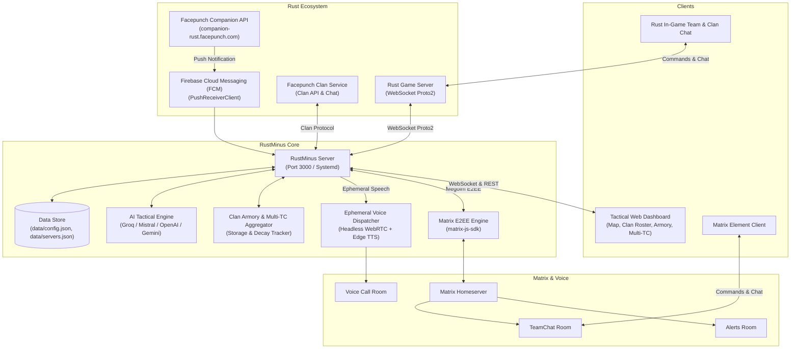

# ⚡ rustminus

> **Next-Generation Rust+ Companion Multi-Server Manager, Tactical Web Radar, and Matrix E2EE Voice Sentinel**

[](https://nodejs.org/)
[](https://unlicense.org/)
[](https://github.com/liamcottle/rustplus.js)
[](https://matrix.org/)

`rustminus` is an all-in-one companion management platform for Rust players, clans, and server operators. It bridges live Rust+ game servers, Facepunch Firebase Cloud Messaging (FCM) push notifications, a high-performance web dashboard with an interactive tactical map, Matrix end-to-end encrypted (E2EE) chat rooms, and automated WebRTC voice call alerts.

---

## 🌟 Key Features

### 1. 🗺️ Interactive Tactical Island Radar (`getMap`)
- **Real-Time Map Rendering:** Streams high-resolution in-game JPEG imagery directly from Facepunch servers.
- **Dynamic Pan & Zoom:** Interactive HTML5 Canvas with smooth wheel zoom, click-and-drag panning, and one-click centering.
- **26×26 Tactical Grid:** Accurate sector grid overlay (A0 through Z25) matching in-game Rust coordinates.
- **Monument Pins & CCTV Directory:** Visual markers for all major monuments with built-in CCTV camera identifiers (`OILRIG1-6`, `DOME1-3`, `LAUNCHSITE1-4`, `AIRFIELD1-4`, etc.).
- **Squad Death Markers & Map Pings:** Renders squad death markers (`💀`) with player name and time-ago indicator, plus team map notes and pings (`📍`).
- **Live Sector Coordinate Tracking:** Real-time meter coordinate readout `(X, Y)` and sector calculation on cursor hover.

### 2. ℹ️ Rust Server Telemetry (`getInfo`)
- **Server Identity Banner:** Displays official header banner image, server logo, and connection endpoints.
- **Live Capacity Meter:** Visual player count gauge (`online / max`) with animated progress bar and active queue count.
- **Procedural World Specs:** Map type (`Procedural Map`), map size (e.g., `4500m`), procedural seed, and salt.
- **Wipe Clock:** Calculates time elapsed since last server wipe (e.g., `Wiped 2d 6h ago`) and exact timestamp.

### 3. ⏱️ In-Game Time, Celestial Cycle & Tactical Alerts (`getTime`)
- **Digital In-Game Clock:** Real-time Rust world time display (e.g., `18:42`).
- **Celestial Arc & Gauge:** Visual daylight progress bar displaying exact sunrise and sunset times.
- **Daylight Countdown:** Real-time calculation of remaining daylight minutes until sunset or night minutes until sunrise.
- **Automated Day/Night Tactical Countdowns:** Automatic chat and Matrix broadcast alerts:
  - 🌌 **5 Minutes to Sunset:** Early warning to prepare Night Vision Goggles (NVGs), weapon flashlights, and compound defense.
  - 🌅 **5 Minutes to Sunrise:** Advance notice for squad roam preparations and deep monument runs.
  - 🌅 **2 Minutes to Sunrise:** Final dawn alert to stow NVGs and gear up for daytime combat.

### 4. 🛒 Vending Marketplace & Event Radar (`getMapMarkers`)
- **Active World Event Radar:** Live tracking and map pin overlay for:
  - 🚢 Cargo Ship (with real-time heading and rotation angle)
  - 🚁 Patrol Helicopter
  - 🛩️ CH47 Chinook
  - 📦 Locked Crates (Oil Rig, Cargo, Monuments)
  - 💥 Explosions & Breaches
- **Island Vending Machine Search:**
  - Built-in Rust item dictionary translating item IDs into names and descriptions.
  - Search any item for sale (e.g., `sulfur`, `rocket`, `c4`, `scrap`, `cloth`, `metal`).
  - Filters for **In-Stock Only** and **Blueprints Only**.
  - Detailed pricing, required currency, available stock, and blueprint badges.

### 5. 👥 Team & 80-Man Clan Squad Organization
- **Active Team Roster:** Real-time display of current in-game squad members with Steam avatars, profile links, and 👑 Leader indicators.
- **Status & Coordinates:** `🟢 Online & Alive`, `💤 Sleeping`, and `💀 Dead` status with live grid sectors (e.g. `N13`) and `(X, Y)` coordinates.
- **Squad Tagging & Role Assignment:** Purpose-built for 65–80+ player clans and zergs that rotate through the 8/16-man in-game team cap. Organizes players into functional squads:
  - 🔴 **Alpha** (Primary PvP / Raid Roam)
  - 🔵 **Bravo** (Secondary Roam / Monument Control)
  - 🟢 **Farm** (Resource Harvesting / Node Runners)
  - 🛡️ **Defense** (Compound Defenders / Anti-Air)
  - ✈️ **Pilots** (Scrappy / Mini-Copter Transports)
  - ⚪ **Unassigned** (Incoming Recruits / Alumni)
- **Persistent Squad Storage:** Squad designations persist across wipes in `data/clan_squads.json`, with quick filtering tabs in the WebUI and in-game `!setsquad` commands.
- **Teammate Reconnect Announcements:** Automatically detects and broadcasts when a team member logs online after being offline for hours (e.g. `🟢 Team member MooMan is now online after being offline for 4.5 hours.`). Includes configurable hour threshold, spam debounce against rapid reconnects, and multi-channel dispatch across In-Game Team Chat, Facepunch Clan Chat, Matrix E2EE, and WebUI event log.
- **Searchable Alumni Roster:** Tracks every player who joined the team during the wipe with last-seen timestamps and one-click team leader promotion.

### 6. 🏰 Facepunch Clan System & In-Game MOTD Bridge
- **Official Facepunch Clan API:** Deep integration with Rust's native Clan protocol (`fetchClanInfo`, `fetchClanChat`, `sendClanMessage`, `setClanMotd`).
- **Bidirectional Clan Chat Bridge:** Chat seamlessly between in-game Clan Chat, the WebUI Clan Stream, and Matrix channels.
- **Live Clan MOTD Dispatch:** Edit and broadcast clan Message of the Day banners directly from the dashboard or in-game using `!motd <message>`.
- **Clan Leaderboard & Role Telemetry:** Real-time visibility into clan roles, leaders, offline/online counts, and clan member lists.

### 7. 💣 Clan Armory & Interactive Raid Target Calculator
- **Cross-Container Inventory Aggregation:** Aggregates explosive and armory reserves across all paired smart storage boxes, drop chests, and lockers.
- **Boom Inventory:** Real-time counts of Rockets, Timed Explosive Charges (C4), Satchel Charges, and Explosive 5.56 Ammo.
- **Total Raid Sulfur Potential:** Automatically computes total explosive power converted to raw sulfur equivalent:
  - 🚀 **1x Rocket:** 1,400 Sulfur
  - 🧨 **1x C4:** 2,200 Sulfur
  - 🎒 **1x Satchel:** 480 Sulfur
  - 💥 **1x Explosive 5.56 Ammo:** 25 Sulfur
  - 🟡 **Raw Sulfur & Gunpowder:** 1:1 and 1:2 conversion
- **Interactive Raid Target Calculator:**
  - Calculates exact explosive requirements for any structure breakdown (e.g. `3 garage doors and 1 stone wall`, `2x2 starter`, `4 armored doors`).
  - Cross-references against live armory boom inventory to give instant readiness: **✅ READY FOR ROCKET RAID**, **✅ READY FOR C4 RAID**, or **❌ SHORT (Need X more rockets)**.
  - Interactive preset buttons in WebUI and in-game commands: `!raidcost <target>` and `!canweraid <target>`.

### 8. 🛡️ Multi-TC Compound Upkeep Grid
- **Decay Tracking for Complex Compounds:** Monitors Main Base Tool Cupboard (TC) plus all External, Flank, and Gatehouse TCs.
- **Upkeep Countdown:** Displays remaining protected upkeep hours, decay warnings, and exact resource consumption (Wood, Stone, Metal, HQM).
- **Fast Status Query:** Teammates can check whole-compound upkeep status instantly with `!multitc` or `!tcs`.

### 9. 🚨 Automated Compound Defense Lockdown & Web Siren
- **Emergency Panic Lockdown:** Instant compound lockdown triggered via WebUI button, in-game command `!lockdown on`, or automated Smart Alarm breach.
- **Automated Batch Defense:**
  - ⚡ Sets all compound Auto-Turrets to **ON**
  - 🚀 Sets all SAM Air Defense Sites to **ON**
  - 🚪 Closes all paired compound Smart Doors and Gates
  - 🚨 Activates emergency strobe and siren lights
  - 📢 Broadcasts emergency lockdown alert to in-game Team Chat and Clan Chat
- **Web Audio API Raid Siren:** Browser-synthesized emergency raid siren (sawtooth sweep from 650Hz to 1150Hz) plays directly in the dashboard during raids and lockdowns, complete with header mute toggle.
- **Stand Down / Cancel:** Deactivate lockdown at any time via WebUI banner or `!unlockdown`.

### 10. 🤖 AI Tactical Assistant with Live Server Context
- **Multi-Provider LLM Engine:** Native support for **Groq** (ultra-fast Llama-3.3-70b / Llama-3.1-8b), **Mistral AI**, **OpenAI**, and **Google Gemini**.
- **Live Context Injection:** Automatically injects real-time server and compound state into every AI prompt:
  - Current in-game time and minutes until dawn/dusk
  - Online player population, queue, and wipe age
  - Active team member positions, status, and dead squad mates
  - Total explosive stockpile and raw sulfur raiding power
  - Multi-TC upkeep hours remaining
  - Compound defense lockdown status
  - Monument CCTV camera codes directory (Large/Small Oil Rig, Dome, Airfield, Launch Site, etc.)
  - Active world events (Cargo, Heli, Chinook, Crates)
- **In-Game Querying:** Ask tactical questions directly from team chat: `!ai how many rockets do we have?`, `!ai what cameras are on Large Oil Rig?`, `!ai can we raid a 2x2 with 4 stone walls?`.

### 11. ⚡ Master Base Automation
- **Batch Base Controls:** One-click toggles for all compound Auto-Turrets, SAM air defense sites, compound lights, and smart doors.
- **Emergency Strobe:** Rapidly strobes paired switches for disco or warning beacon effects.
- **Smart Alarms:** Listens for in-game sensor triggers and dispatches instant push, Matrix, and voice alerts.

### 12. 🔐 Matrix E2EE Integration & Ephemeral Voice Bot
- **Matrix Rooms:** Dedicated channels for **Alerts**, **In-Game Team Chat Relay**, and **Raid Alarms**.
- **In-Game Commands:** Full remote base control from in-game team chat or Matrix.
- **Ephemeral Voice Announcer:** High-speed (150%) text-to-speech WebRTC audio injection into Matrix voice rooms with connect-speak-disconnect lifecycle (zero idle ghost bots).

---

## 🏗️ Architecture



---

## 🔒 Security Notice

This repository contains **NO API keys, passwords, session tokens, or private secrets**. 
All sensitive operational parameters are loaded from `data/config.json` and `data/servers.json` (which are strictly ignored by `.gitignore`), or via standard environment variables.

---

## 🚀 Quickstart & Installation

### Prerequisites
- **Operating System:** Linux (Ubuntu 20.04/22.04/24.04 recommended), macOS, or Windows WSL2
- **Node.js:** v18.0.0 or newer
- **Python 3:** (optional, for edge-tts voice alert synthesis: `pip install edge-tts`)
- **FFmpeg:** (optional, for voice alerts audio normalization: `sudo apt install ffmpeg`)
- **Chromium:** (optional, for automated WebRTC voice room joining)

### 1. Clone the Repository
```bash
git clone https://github.com/pranabeshsingh/rustminus.git
cd rustminus
```

### 2. Install Dependencies
```bash
npm install
```
> **Note:** The postinstall script `scripts/patch-rustplus.js` runs automatically during `npm install` to update the underlying `@liamcottle/rustplus.js` library with modern Facepunch protobuf schemas and Promise/async-await support.

### 3. Configure Credentials
Copy the provided example configuration templates:
```bash
cp data/config.example.json data/config.json
cp data/servers.example.json data/servers.json
```

#### A. Generate Admin Password Hash
Generate a bcrypt hash for your web dashboard administrator password:
```bash
node -e 'const bcrypt = require("bcrypt"); console.log(bcrypt.hashSync("YourSecurePassword123!", 10));'
```
Paste this hash into `data/config.json` under `"adminPasswordHash"`.

#### B. Configure Matrix (Optional)
If using Matrix notifications, fill in `data/config.json` with your Matrix homeserver URL, bot credentials, and room IDs.

#### C. Configure Rust Server
Add your server details to `data/servers.json`:
```json
[
  {
    "id": "srv_main_1",
    "name": "[US] Rust Server",
    "ip": "123.45.67.89",
    "port": 28082,
    "playerId": "76561198000000000",
    "playerToken": 123456789,
    "useFacepunchProxy": false,
    "isActive": true,
    "switches": [],
    "alarms": []
  }
]
```
*(You can also pair servers automatically using the built-in FCM listener in the WebUI)*.

### 4. Start the Application
```bash
npm start
```
Open your browser and navigate to:
```
http://localhost:3000
```
Log in using username `admin` and your configured password.

---

## ⚙️ Production Deployment (systemd & Caddy)

### 1. systemd Service
Copy the unit file:
```bash
sudo cp deployment/rustplus-manager.service /etc/systemd/system/
sudo systemctl daemon-reload
sudo systemctl enable --now rustplus-manager.service
```

Check status:
```bash
sudo systemctl status rustplus-manager.service
```

### 2. Reverse Proxy with SSL (Caddy)
Add the following to `/etc/caddy/Caddyfile`:
```caddy
rust.yourdomain.com {
    reverse_proxy 127.0.0.1:3000
}
```
Reload Caddy:
```bash
sudo systemctl reload caddy
```

---

## 🎮 Command Directory

Commands can be executed directly inside **In-Game Team Chat**, **Clan Chat**, or the **Matrix `#team-chat` channel**. Supports both `!` and `.` prefixes.

### Server & Tactical Intelligence
| Command | Description | Example Output |
| :--- | :--- | :--- |
| `!info` / `!server` | Server name, map size, seed, player pop, wipe date | `ℹ️ [Server Info] Rustoria Main \| 4500m \| Seed: 1234 \| Wiped 1d 4h ago` |
| `!pop` / `!players` | Current player population and queue | `👥 [Pop] 385/400 Online \| Queue: 12` |
| `!time` / `!day` / `!night` | In-game clock, dawn/dusk times, and active phase | `☀️ [Time] 14:15 \| Sunrise: 07:31 \| Sunset: 20:05 (Day • Night in ~12m)` |
| `!daynight` / `!cycle` | Exact minutes remaining until next dawn or dusk | `🌓 [Celestial Status] 4.8 mins until sunset (Night). Prepare NVGs!` |
| `!cams [monument]` | Look up official CCTV camera identifiers for monuments | `📹 [LARGE OIL RIG] OILRIG1 (Helipad), OILRIG2 (Crane), OILRIG3 (Exhaust)...` |
| `!events` / `!map` | Active world events (Cargo, Heli, Chinook, Crates) | `🗺️ [Active Events] Cargo Ship @ G14 \| Patrol Helicopter @ N11` |
| `!vending <item>` | Search island vending machines for item and price | `🛒 [Matches for "rocket"] "Raid Shop" @ M14: 1x Rocket for 500 Scrap` |

### Clan & Team Operations (65–80 Player Roster)
| Command | Description | Example Output |
| :--- | :--- | :--- |
| `!clan` / `!roster` | Clan tag, active MOTD, member count, and leaders | `🏰 [Clan: CHUPAPI] Tag: [CHUP] \| Members: 24/80 (8 Online) \| MOTD: Raid at 8PM` |
| `!motd <message>` | View or update and broadcast the in-game Clan MOTD | `📢 [Clan MOTD Updated] "Roam squad meet at Launch Site!"` |
| `!squads` / `!squad [name]` | View active squads breakdown or inspect specific squad roster | `🏰 [Clan Squad Directory] • [Alpha] 6 members • [Farm] 12 members...` |
| `!setsquad <player> <squad>` | Assign a clan member to a squad (Alpha, Bravo, Farm, Defense, Pilots) | `🏰 Assigned Player1 to [Squad Alpha].` |
| `!team` | Active in-game squad health, status, and grid sector | `🛡️ [Team] Player1 🟢 Alive [N13] \| Player2 💤 Sleeping [M12]` |
| `!locate <name>` | Locate teammate's exact grid and distance | `📍 Player1 is in grid [N13] (342m away)` |
| `!death [name]` | Teammate's last death location and time | `💀 Player1 died in [G14] 4m ago` |
| `!afk` | Lists squad members currently inactive or sleeping | `💤 [AFK] Player2 (Sleeping for 28m) \| Player3 (Stationary 12m)` |
| `!teamalert [h\|on\|off\|test]` | View/set threshold for member reconnect alert | `👥 [Team Reconnect Alert] Min offline threshold set to 2 hour(s).` |
| `!promote <name>` | Promotes a teammate to in-game Team Leader | `👑 Promoted Player1 to Team Leader!` |
| `!kick <name>` | Removes a player from the current in-game team | `🚪 Kicked Player4 from the team.` |

### Compound Boom, Armory & Multi-TC
| Command | Description | Example Output |
| :--- | :--- | :--- |
| `!raidcost <target>` | Calculate explosives & sulfur needed for target base | `🎯 [Raid Cost: 3x GARAGE DOOR] Rockets: 9x \| C4: 6x \| Sulfur: 12.6k` |
| `!canweraid <target>` | Compare target raid cost against live Clan Armory stockpile | `🏰 [Armory Readiness] ✅ READY FOR ROCKET RAID! (Have 18/9 Rockets)` |
| `!boom` | Aggregated explosive count across all compound boxes | `💣 [Boom Armory] 18x Rockets \| 6x C4 \| 14x Satchels \| 650x Explo 5.56` |
| `!sulfur` / `!gp` | Total raid sulfur potential calculation across compound | `🟡 [Raid Sulfur Power] Total Potential: 52,400 Sulfur (32 Rockets + 4 C4 + Raw)` |
| `!armory` | Overview of armory containers, weapons, ammo, & sulfur | `📦 [Armory Summary] 4 Containers \| 22 Guns \| 1.4k 5.56 Ammo \| 52.4k Sulfur Eq.` |
| `!multitc` / `!tcs` | Upkeep decay countdowns for all compound TCs | `🛡️ [Multi-TC Upkeep] Main TC: 38h \| Flank West: 42h \| Gatehouse: 18h ⚠️` |
| `!upkeep [tc]` | Detailed upkeep consumption for a specific TC | `🛡️ [Upkeep: Main TC] 38h 12m remaining \| 2.4k Wood, 8.2k Stone, 1.1k Metal` |
| `!contains <item>` | Search compound storage boxes for an item | `📦 [Found "c4"] 6x Timed Explosive Charge in "Main Armory Box 1"` |
| `!contents <box>` | List all items inside a paired smart storage container | `📦 [Box: Drop Chest 1] 2x AK-47, 120x 5.56 Ammo, 1x Metal Facemask` |

### Compound Switches & Base Automation
| Command | Description | Example Output |
| :--- | :--- | :--- |
| `!lockdown on` / `off` | Trigger or stand down emergency compound lockdown defense | `🚨 [COMPOUND LOCKDOWN] Turrets: ON \| SAMs: ON \| Doors: CLOSED` |
| `!unlockdown` | Alias to stand down base defense lockdown | `🟢 [LOCKDOWN CANCELLED] Stand down. Base defense alert resolved.` |
| `!turrets on` / `off` | Batch toggles all compound auto-turrets | `⚡ Set 6/6 Turrets to ON.` |
| `!sams on` / `off` | Batch toggles roof SAM air defense sites | `⚡ Set 3/3 SAMs to ON.` |
| `!lights on` / `off` | Batch toggles base and compound lighting grid | `⚡ Set 12/12 Lights to ON.` |
| `!doors on` / `off` | Batch toggles smart door controllers | `⚡ Set 4/4 Doors to OFF.` |
| `!on` / `!off <name>` | Toggles a specific switch by name or ID | `⚡ Set "Compound Gates" (ID: 104829) to ON.` |
| `!ttoggle <time> <sw>` | Temporarily toggles a switch, then reverts automatically | `⏳ Toggled "Airlock Door" for 15s.` |
| `!strobe <name>` | Rapidly strobes a named switch for alarms/disco | `✨ Strobing switch "Warning Lights" (ID: 104829)!` |

### AI Assistant & Utilities
| Command | Description | Example Output |
| :--- | :--- | :--- |
| `!ai <question>` | Ask tactical squad AI with live server & base context | `🤖 [AI] With 18 rockets and 6 C4, you can blow 3 sheet metal doors and 2 stone walls...` |
| `!timer <time> <msg>` | Sets a timed reminder in chat and Matrix | `⏰ Set timer for 15m: "Oil Rig crate unlock".` |
| `!calc <expression>` | In-game calculator for raid sulfur / scrap math | `🔢 [Calc] 18 * 1400 = 25200` |
| `!speak <message>` | Dispatches instant WebRTC voice broadcast to Matrix | `🔊 Broadcasted "Cargo Ship entering map" to Matrix voice call!` |
| `!status` | Server connection and Matrix bot status | `🤖 [Status] Server: Connected 🟢 \| Matrix: Online 🟢` |
| `!help` | In-game command listing and quick syntax guide | Displays quick directory of available commands |

---

## 🤝 Contributing

Contributions, issues, and feature requests are welcome! Feel free to check the [issues page](https://github.com/pranabeshsingh/rustminus/issues).

---

## 📜 License

Distributed under The Unlicense (Public Domain dedication). See [`LICENSE`](LICENSE) for more information.
